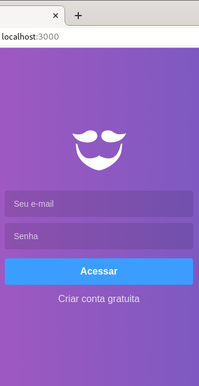

<h1 align="center">
  
</h1>


<h3 align="center">
  :rocket: [Bootcamp GoStack#10] GoBarber
</h3>

## Projeto
GoBarber é um projeto desenvolvido durante o Bootcamp GoStack#10 da RocketSeat. Tem como objetivo a criação de uma aplicação para a gestão de um salão de beleza.

## Screenshots
<h1 align="center">
  
  
  
</h1>

### Running

```sh
docker-compose up
```

Abra em seu navegador: `localhost:3000`  
email: `barbeiro@teste.com`  
senha: `123456`  

Se preferir subir o projeto sem o docker-compose, siga o [tutorial da wiki](https://github.com/emanuelhfarias/GoBarber/wiki/Instala%C3%A7%C3%A3o).

### Algumas __features__
* Agendamento de clientes com prestadores de serviços
* Envio de email de cancelamento de um agendamento
* Sistema de notificação para os prestadores de serviços informando sobre os novos agendamentos.
* Horários disponíveis de um prestador de serviço.
* Autenticação (JWT) de clientes e prestadores de serviços.
* Upload de avatar

### Algumas tecnologias utilizadas:
* Sistema de notificações com MongoDB
* Envio de email usando Filas com Redis
* Error Tracking com Sentry
* PostgresQL
* Express
* BeeQueue

### TODO
* Colocar _insomnia button_ no README
* Uma wiki no GitHub explicando as rotas
