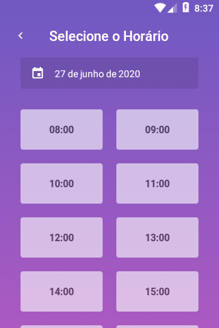
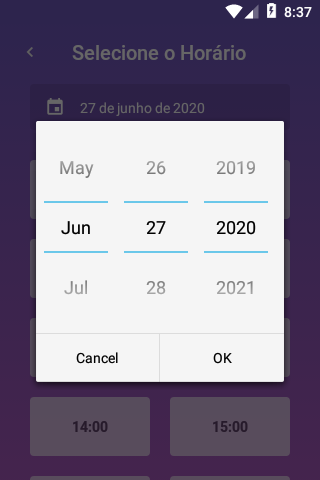

Antes de subir o emulador de Android / iOS, tenha o backend rodando:
```sh
$ docker-compose up
```

Agora suba o Emulador Android / iOS e depois rode os seguintes comandos:

```sh
yarn
react-native start
react-native run-android
```

### Debugging with Reactotron
```sh
# first open Reactotron
$ react-native start
$ react-native run-android
$ adb reverse tcp:9090 tcp:9090 # wait Android Emulator open before run this command
# kill "react-native start" and start again
$ react-native start
# now Reload app with "react-native start": press "r"
```

Now you should see device connected on Reactotron
REF: https://github.com/infinitered/reactotron/blob/master/docs/quick-start-react-native.md

## :camera: Screenshots

<h1 align="center">
  
  
  
  
  
  
  
  
</h1>
